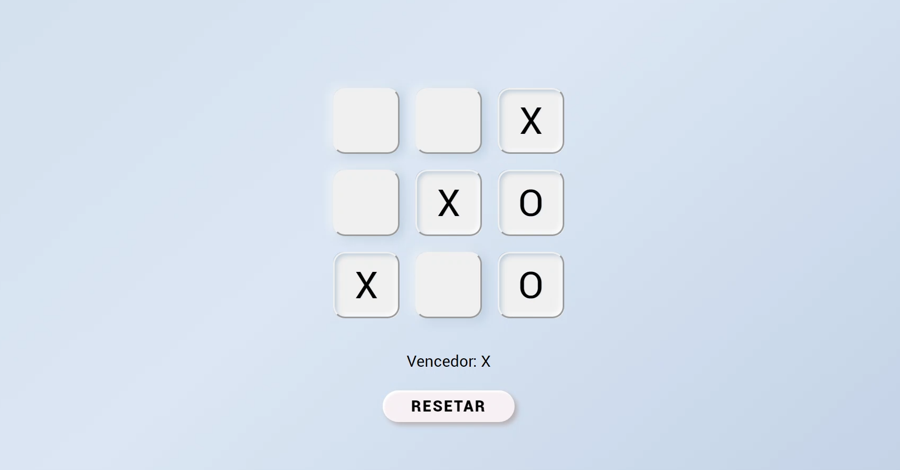

<h1 align="center">
  
<br>
Tic Tac Toe Neomorphism
</h1>

<p align="center"> A Tic Tac Toe Game with Neomorphism style

## Features
To create that web application was used:

- ⚛️ **React Js** — JavaScript lib to create interfaces

## Project

A simple application to show informations about a Github repository through the Github's API.

## Getting started

###  Frontend
Follow the steps below to start the application:
```bash
yarn install
yarn start
```

## How to contribute
- First leave a ⭐!
- Fork the repositories in production as they are updated: <a href="https://github.com/guilhermeorcezi/todolist"> MonoRepo;</a>
- Create a branch with your feature: `git checkout -b my-feature`;
- Commit your changes: `git commit -m 'feat: My new feature'`;
- Push to your branch: `git push origin my-feature`.

## License

This project is licensed by MIT License - Go to the [licençe page](https://opensource.org/licenses/MIT) to see more details.
